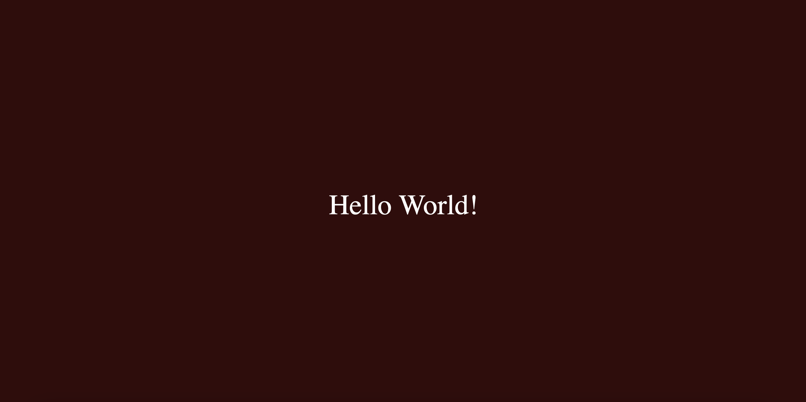

# Hello World

In this repository you find our HTML/Javascript implementation of an "Hello World" program. It was implemented the course "Wissenschaftliches Arbeiten" at the University of Regensburg.

## Description

When running this application you will first see the dark red screen. Every 0.3 seconds a new letter appears. After the full sentence "Hello Word!" is displayed it disappears and starts over.

##  Requirements & Installation
To run this program you need a browser like Firefox, Chrome or Microsoft Edge (Firefox works best). After downloading the repository content and unzipping the files you double click on the `index.html` file to open the program in your preferred standard browser.

